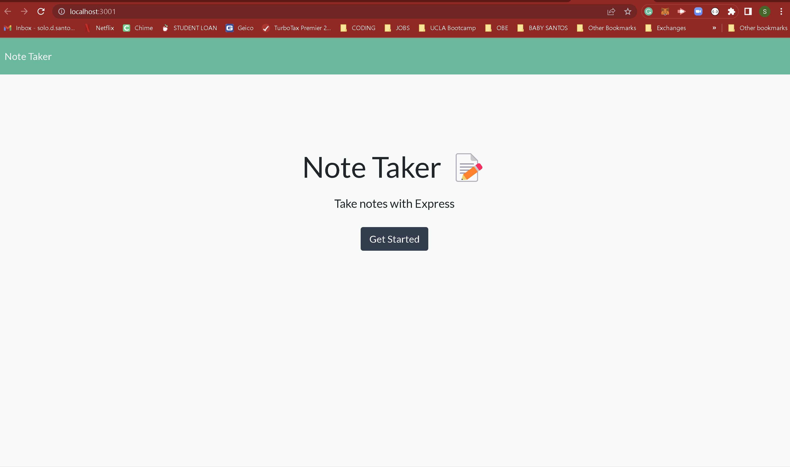

# Note Tracker

## Table of Contents
- [Note Tracker](#note-tracker)
  - [Table of Contents](#table-of-contents)
  - [Technology Used](#technology-used)
  - [Description](#description)
  - [Usage](#usage)
  - [Installation](#installation)
  - [License](#license)
  - [Author Info](#author-info)

## Technology Used


| Technology Used |                              Resource URL                               |
| --------------- | :---------------------------------------------------------------------: |
| HTML            |     [MDN - HTML](https://developer.mozilla.org/en-US/docs/Web/HTML)     |
| JavaScript      |   [MDN - JS](https://developer.mozilla.org/en-US/docs/Web/JavaScript)   |
| Git             |                       [Git](https://git-scm.com/)                       |
| Node            |                [Node Docs](https://nodejs.org/en/docs/)                 |
| NPM             |                   [NPM Docs](https://docs.npmjs.com/)                   |
| Express         |                 [Express Docs](https://expressjs.com/)                  |
| uuid            | [uuid Docs](https://github.com/uuidjs/uuid#uuidv1options-buffer-offset) |
| Heroku          |    [Heroku Docs](https://devcenter.heroku.com/categories/reference)     |


## Description
To visit the deployed application [Click Here!](https://still-ridge-87480.herokuapp.com/)

For this project I was asked to create an application that can be used to write and save notes. The application uses an Express.js back end to save and retrieve the note data from a JSON file.

## Usage



## Installation

```
npm i / npm install
```

```'
npm start
```

## License

Please see [GitHub Repo](https://github.com/captaiiinsolo/noteTaker) for license information.

## Author Info

Solomon Santos is currently a student at the UC Berkeley Full Stack Coding Boot Camp. He is expected to gradaute in March 2023. Feel free to reach out to him via any of the social channels below.

- [LinkedIn](https://www.linkedin.com/in/solomon-santos)
- [GitHub](https://www.github.com/captaiiinsolo)
- [Twitter](https://twitter.com/captaiiinsolo)


